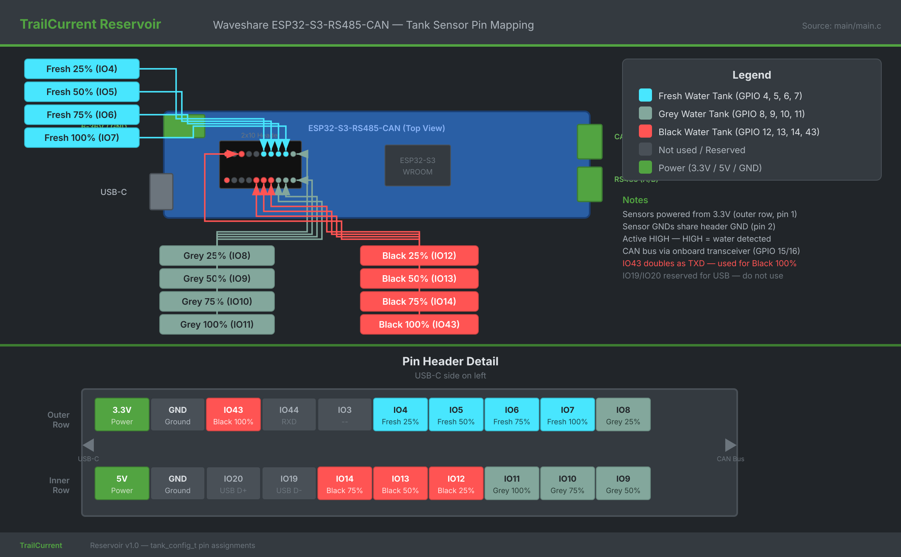
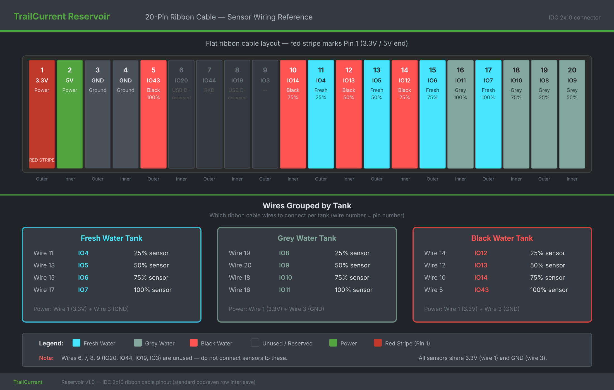

# TrailCurrent Reservoir

Water tank level monitoring module that reads contactless level sensors on up to three tanks (fresh, grey, black water) and transmits fill percentages over a CAN bus interface. Part of the [TrailCurrent](https://trailcurrent.com) open-source vehicle platform.

## Hardware Overview

- **Board:** Waveshare ESP32-S3-RS485-CAN
- **Microcontroller:** ESP32-S3
- **Framework:** ESP-IDF with FreeRTOS
- **Function:** Contactless water level sensors to CAN bus bridge
- **Key Features:**
  - Monitors up to 3 water tanks (fresh, grey, black)
  - 4 contactless level sensors per tank (25%, 50%, 75%, 100%)
  - Reports tank levels as 0-100% over CAN bus
  - Percentage-based protocol supports future migration to analog sensors
  - CAN bus output at 500 kbps (TWAI normal mode)
  - Automatic CAN bus recovery from bus-off errors
  - Nodes can enter and leave the network without disrupting the bus
  - Dedicated FreeRTOS tasks for CAN and sensor polling
  - CAN-triggered OTA firmware updates over WiFi (HTTP upload)
  - WiFi credential provisioning via CAN bus
  - Dual OTA partition table for safe updates with rollback
  - 80 MHz CPU clock for reduced power consumption

## Hardware Requirements

### Components

- **Board:** [Waveshare ESP32-S3-RS485-CAN](https://www.waveshare.com/wiki/ESP32-S3-RS485-CAN#Schematic)
- **CAN Bus:** Built-in transceiver (TX: GPIO 15, RX: GPIO 16, 500 kbps)
- **Sensors:** 12x contactless water level sensors (active HIGH output when water detected)
- **Debug Console:** USB CDC (115200 baud)

### Pin Assignments



| Function | GPIO | Description |
|----------|------|-------------|
| CAN TX | 15 | CAN bus transmit (onboard transceiver) |
| CAN RX | 16 | CAN bus receive (onboard transceiver) |
| Fresh 25% | 4 | Fresh water tank, 25% level sensor |
| Fresh 50% | 5 | Fresh water tank, 50% level sensor |
| Fresh 75% | 6 | Fresh water tank, 75% level sensor |
| Fresh 100% | 7 | Fresh water tank, 100% level sensor |
| Grey 25% | 8 | Grey water tank, 25% level sensor |
| Grey 50% | 9 | Grey water tank, 50% level sensor |
| Grey 75% | 10 | Grey water tank, 75% level sensor |
| Grey 100% | 11 | Grey water tank, 100% level sensor |
| Black 25% | 12 | Black water tank, 25% level sensor |
| Black 50% | 13 | Black water tank, 50% level sensor |
| Black 75% | 14 | Black water tank, 75% level sensor |
| Black 100% | 43 | Black water tank, 100% level sensor |

All sensor GPIOs are configured as inputs with internal pull-down resistors.

### Ribbon Cable Pinout

When connecting via a 20-pin IDC ribbon cable, the red stripe aligns with pin 1 (3.3V/5V end). The sensor wires are interleaved due to standard odd/even row numbering.



## Firmware

The firmware uses ESP-IDF with FreeRTOS. Source is in the `main/` directory.

### Prerequisites

- [ESP-IDF v5.5+](https://docs.espressif.com/projects/esp-idf/en/stable/esp32s3/get-started/)

### Build and Flash

```bash
# Set ESP-IDF environment
. $HOME/esp/esp-idf/export.sh

# Build
idf.py build

# Flash via USB (development)
idf.py -p /dev/ttyACM0 flash

# Monitor serial output
idf.py -p /dev/ttyACM0 monitor
```

### Creating Release Binaries

The standard `idf.py build` produces `build/reservoir.bin` — the application image only. This is the correct binary for OTA updates, where Headwaters writes it directly to an app partition via the device's `/ota` HTTP endpoint.

The TrailCurrent web flasher needs a different binary: a merged image containing the bootloader, partition table, OTA data, and application combined into a single file that gets flashed at offset 0x0. Without this, the web flasher would write the application binary to the wrong flash offset, resulting in a non-booting device.

After building, run the merge script to create the merged binary:

```bash
idf.py build
./merge.sh
```

This produces two files in `build/`:

| File | Contents | Used By |
|------|----------|---------|
| `reservoir.bin` | Application image only | Headwaters OTA (`deploy.sh`, `ota.js`), direct `curl` uploads |
| `reservoir_merged.bin` | Bootloader + partition table + OTA data + application | Web flasher (full flash at 0x0) |

**Both files must be attached to each GitHub release:**

```bash
git tag -a v1.0.0 -m "Firmware release v1.0.0"
git push origin v1.0.0

gh release create v1.0.0 \
  build/reservoir.bin \
  build/reservoir_merged.bin \
  --repo trailcurrentoss/TrailCurrentReservoir \
  --title "v1.0.0" \
  --notes "Firmware release v1.0.0"
```

The web flasher matches `reservoir_merged.bin` by the "merged" keyword in the filename. The Headwaters deployment system (`fetch-firmware.sh`) downloads the app-only `reservoir.bin` for OTA delivery.

### Architecture

The firmware runs two FreeRTOS tasks:

- **Main task** - Polls all 12 water level sensor GPIOs every 500ms and converts binary sensor states to tank fill percentages.
- **TWAI task** - Manages the CAN bus independently on core 1. Handles bus-off detection, automatic recovery, and periodic non-blocking transmission of tank levels. Bus errors never stall sensor polling.

See [DOCS/firmware-architecture.md](DOCS/firmware-architecture.md) for detailed architecture documentation.

### CAN Bus Recovery

The TWAI driver runs in **normal mode** with full alert handling:

1. **Bus-off detected** - Transmissions stop, `twai_initiate_recovery()` is called
2. **Bus recovered** - Driver restarts via `twai_start()`, transmissions resume
3. **Error passive** - Logged as a warning (typically means no peers are ACKing)

This allows nodes to be connected and disconnected from the bus at any time without crashing the firmware or requiring a reboot.

### Sensor Reading Logic

Water rises from bottom to top, triggering sensors sequentially. The reported level equals the highest sensor reading HIGH:

| Sensors Triggered | Reported Level |
|-------------------|---------------|
| None | 0% |
| 25% only | 25% |
| 25% + 50% | 50% |
| 25% + 50% + 75% | 75% |
| All four | 100% |

If a tank is not physically connected, all its sensors remain LOW and the level reports 0%.

### CAN Bus Protocol

The device communicates at 500 kbps using standard 11-bit CAN IDs.

**Received Messages:**

| CAN ID | Name | Description |
|--------|------|-------------|
| 0x00 | OTA Trigger | 3 bytes: target device MAC (last 3 bytes). Enters OTA mode if matched. |
| 0x01 | WiFi Config | Chunked credential provisioning (start/SSID chunks/password chunks/end). |
| 0x02 | Discovery | Broadcast trigger for mDNS self-discovery. |

**Transmitted Messages:**

| CAN ID | Name | Cycle | Description |
|--------|------|-------|-------------|
| 0x04 | Version Report | Once at boot | `[mac3, mac4, mac5, major, minor, patch]` |
| 0x3E | WaterTankLevels | 1000ms | 3 bytes: fresh %, grey %, black % |

**Message 0x3E - WaterTankLevels** (3 bytes):

| Byte | Signal | Range | Unit | Description |
|------|--------|-------|------|-------------|
| 0 | FreshWaterLevel | 0-100 | % | Fresh water tank fill level |
| 1 | GreyWaterLevel | 0-100 | % | Grey water tank fill level |
| 2 | BlackWaterLevel | 0-100 | % | Black water tank fill level |

See [DOCS/can-protocol.md](DOCS/can-protocol.md) for full protocol details including encoding examples and future analog sensor considerations.

### OTA Firmware Updates

The device supports over-the-air firmware updates triggered via CAN bus, matching the TrailCurrent OTA protocol used across all nodes.

**How it works:**

1. Headwaters (Raspberry Pi) sends CAN ID `0x00` with the target device's last 3 MAC bytes
2. If the MAC matches, the device connects to WiFi and starts an HTTP server
3. Firmware is uploaded via HTTP POST to the device
4. After upload, the device reboots into the new firmware
5. If no upload arrives within 3 minutes, WiFi disconnects and normal operation resumes

**Uploading firmware:**

OTA writes only to the app partition, so always use `reservoir.bin` (the app-only binary), never `reservoir_merged.bin`. The merged binary contains the bootloader and partition table, which would fail the app image validation in `esp_ota_end`.

```bash
# Find device hostname from serial output (e.g., esp32-8A3B4C)
# After OTA mode is triggered:
curl -X POST http://esp32-XXYYZZ.local/ota --data-binary @build/reservoir.bin
```

**WiFi credential provisioning:**

WiFi credentials are stored in NVS and provisioned via CAN ID `0x01` using a chunked message protocol. See the TrailCurrent CAN Bus Reference for the full specification.

**Partition layout:**

The device uses a dual OTA partition scheme for safe updates with automatic rollback:

| Partition | Type | Size |
|-----------|------|------|
| nvs | data (nvs) | 20 KB |
| otadata | data (ota) | 8 KB |
| app0 | app (ota_0) | 1792 KB |
| app1 | app (ota_1) | 1792 KB |
| spiffs | data (spiffs) | 448 KB |

## Documentation

Detailed documentation is available in the [DOCS/](DOCS/) directory:

- [High-Level Requirements](DOCS/Requirements/high-level-requirements.md) - System requirements and design rationale
- [Firmware Architecture](DOCS/firmware-architecture.md) - Task structure, data flow, and timing
- [CAN Protocol](DOCS/can-protocol.md) - Complete CAN message specification
- [Sensor Wiring Guide](DOCS/sensor-wiring.md) - Installation, wiring, and troubleshooting
- [Board Pin Mapping](DOCS/reservoir-pinout.svg) - GPIO-to-sensor visual pin diagram
- [Ribbon Cable Pinout](DOCS/reservoir-ribbon-cable.svg) - 20-pin IDC ribbon cable wiring reference

## Project Structure

```
├── DOCS/                             # Detailed documentation
│   ├── Requirements/
│   │   └── high-level-requirements.md
│   ├── firmware-architecture.md
│   ├── can-protocol.md
│   ├── sensor-wiring.md
│   ├── reservoir-pinout.svg          # Board pin mapping diagram
│   ├── reservoir-pinout.png
│   ├── reservoir-ribbon-cable.svg    # Ribbon cable wiring diagram
│   └── reservoir-ribbon-cable.png
├── main/                             # ESP-IDF firmware source
│   ├── main.c                        # Sensor polling and CAN transmitter
│   ├── wifi_config.c                 # WiFi credential management via CAN
│   ├── wifi_config.h
│   ├── ota.c                         # OTA update, WiFi, mDNS
│   ├── ota.h
│   ├── discovery.c                   # mDNS self-discovery
│   ├── discovery.h
│   ├── idf_component.yml             # Component dependencies
│   └── CMakeLists.txt                # Component registration
├── partitions.csv                    # Dual OTA partition table
├── CMakeLists.txt                    # ESP-IDF root build file
├── merge.sh                          # Creates merged binary for web flasher / releases
└── sdkconfig.defaults                # ESP-IDF default configuration
```

## License

MIT License - See LICENSE file for details.

This is open source hardware. You are free to use, modify, and distribute these designs under the terms of the MIT license.

## Contributing

Improvements and contributions are welcome! Please submit issues or pull requests.

## Support

For questions about:
- **KiCAD setup:** See [KICAD_ENVIRONMENT_SETUP.md](https://github.com/trailcurrentoss/TrailCurrentKiCADLibraries/blob/main/KICAD_ENVIRONMENT_SETUP.md)
- **Assembly workflow:** See [BOM_ASSEMBLY_WORKFLOW.md](https://github.com/trailcurrentoss/TrailCurrentKiCADLibraries/blob/main/BOM_ASSEMBLY_WORKFLOW.md)
